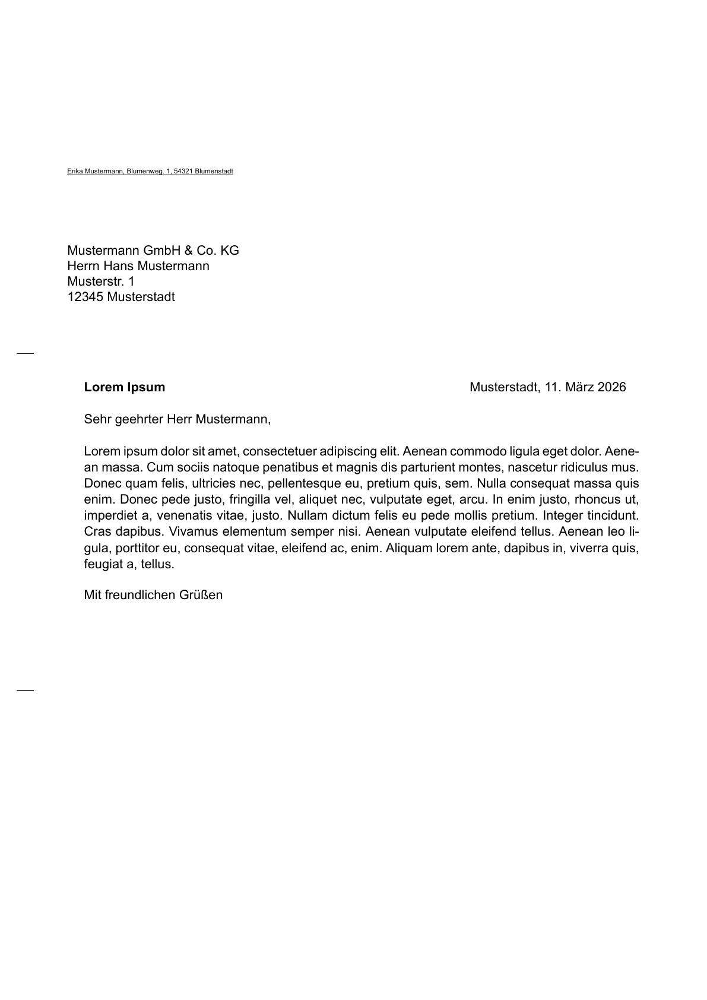
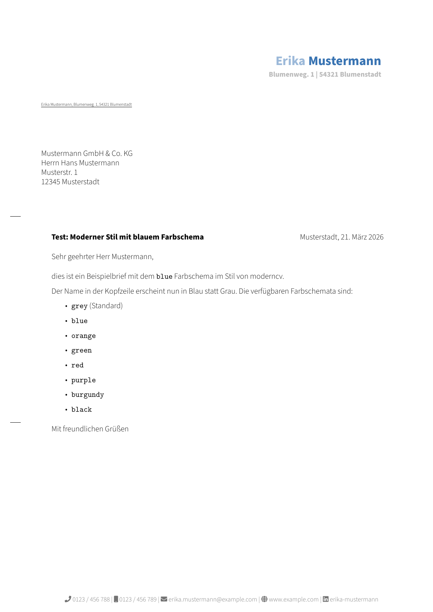

# onlinebrief24

LaTeX-Klasse für DIN-5008-Briefe zur Nutzung mit [onlinebrief24.de](https://onlinebrief24.de).

[onlinebrief24.de](https://onlinebrief24.de) ist ein hybrider Briefversanddienst
für Geschäftskunden: Dokumente werden digital übermittelt, und der Dienst
übernimmt Druck, Kuvertierung, Frankierung und die postalische Zustellung.

> Dieses Repository ist ein Community-Projekt und steht in keiner offiziellen Verbindung zur letterei.de Postdienste GmbH. "onlinebrief24.de" ist ein eingetragenes Markenzeichen der jeweiligen Rechteinhaber. Die Rechteinhaber haben dem Projektmaintainer formal erlaubt, die Marke im Zusammenhang mit dieser LaTeX-Klasse zu verwenden. Die Nutzung erfolgt auf eigenes Risiko; es gibt keine Garantie, dass ein erzeugtes PDF vom Dienstleister in jedem Fall akzeptiert oder unverändert verarbeitet wird.

Die Klasse basiert auf `scrlttr2` aus KOMA-Script und ist auf einen robusten, reproduzierbaren Workflow für deutsche Geschäftsbriefe ausgelegt.

Das Paket ist auch über CTAN verfügbar:
[ctan.org/pkg/onlinebrief24](https://ctan.org/pkg/onlinebrief24)

## Funktionsumfang

- DIN-5008-Typ-B-Grundlayout mit für [onlinebrief24.de](https://onlinebrief24.de) kalibriertem Fensterbereich
- `basic`-Stil ohne Kopf- und Fußzeile
- `modern`-Stil mit Kopfzeile, Fußzeile und Farbschemata
- optionale DIN-nahe rechte Informationsspalte über `infoblock`
- `guides`-Modus zur technischen Sichtprüfung von Zonen, Abständen und Falzmarken
- Option `footercenter` für zentrierte Fußzeile im `modern`-Stil
- Arial als bevorzugte Schrift mit Fallback auf `TeX Gyre Heros`
- Unterstützt XeLaTeX, LuaLaTeX und pdfLaTeX
- Konfigurierbare Dokumentsprache (`lang=<babel-Sprachname>`, Standard: `german`)

## Schnellstart

Installiere das Paket bevorzugt über deine TeX-Distribution und nutze danach
einfach `\documentclass{onlinebrief24}`.

Wenn du direkt aus dem Repository arbeiten oder eine Entwicklungsversion testen
möchtest, siehe unten den Abschnitt `Installation`.

Minimales Beispiel:

```latex
\documentclass[basic]{onlinebrief24}

\setreturnaddress{Erika Mustermann, Blumenweg 1, 54321 Blumenstadt}
\setrecipient{
  Mustermann GmbH \& Co. KG \\
  Herrn Hans Mustermann \\
  Musterstr. 1 \\
  12345 Musterstadt
}
\setsubject{Betreff}
\setplace{Musterstadt}
\setdate{\today}

\begin{document}
\begin{letter}{}
\opening{Sehr geehrter Herr Mustermann,}

dies ist ein Beispielbrief.

\closing{Mit freundlichen Grüßen}
\end{letter}
\end{document}
```

Build (alle drei Engines werden unterstützt):

```bash
xelatex brief.tex
# oder
lualatex brief.tex
# oder
pdflatex brief.tex
```

## Installation

### Über CTAN

Installiere das Paket `onlinebrief24` bevorzugt über den Paketmanager deiner
TeX-Distribution.

Die Paketseite ist:

- [ctan.org/pkg/onlinebrief24](https://ctan.org/pkg/onlinebrief24)

### Lokal im TeX-Baum oder aus dem Repository

Wenn du den aktuellen Repository-Stand unabhängig von CTAN global verfügbar
machen möchtest:

```bash
kpsewhich -var-value TEXMFHOME
mkdir -p "$(kpsewhich -var-value TEXMFHOME)/tex/latex/onlinebrief24"
cp onlinebrief24.cls "$(kpsewhich -var-value TEXMFHOME)/tex/latex/onlinebrief24/"
texhash
```

Danach kannst du `\documentclass{onlinebrief24}` aus beliebigen Projekten verwenden.

## Beispiele

Die Dateien im Verzeichnis `examples/` sind lauffähige Referenzen für die unterstützten Varianten:

- `example-onlinebrief24-basic.tex`: einfacher Brief ohne Kopf- und Fußzeile
- `example-onlinebrief24-infoblock.tex`: Brief mit festem DIN-nahem Informationsblock
- `example-onlinebrief24-modern.tex`: moderner Stil mit Kontaktdaten
- `example-onlinebrief24-modern-blue.tex`: moderner Stil mit alternativem Farbschema

Die reinen Regressionstests für `scripts/verify.sh` liegen bewusst getrennt unter `tests/fixtures/` und sind **nicht** im CTAN-Paket enthalten:

- `signature-regression.tex`: Regressionsfall für kurze Grußformel mit expliziter Signatur
- `multipage-regression.tex`: Mehrseiten-Regressionsfall

Visuelle Vorschau der beiden Varianten:

| Basic | Modern Blue |
| --- | --- |
|  |  |

Hinweis: Die Beispiel-Dateien referenzieren die Klasse absichtlich relativ über `../onlinebrief24`, damit sie direkt aus dem Repository heraus gebaut werden können.

Beispiel-Build:

```bash
cd examples
xelatex example-onlinebrief24-basic.tex
```


## Optionen

### Layout

| Option | Bedeutung |
| --- | --- |
| `basic` | Einfaches Layout ohne Kopf- und Fußzeile |
| `modern` | Moderner Stil mit Kopfzeile, Fußzeile und Akzentfarbe |
| `infoblock` | Blendet oben rechts einen festen DIN-nahen Informationsblock mit Bezugs- und Kontaktdaten ein |
| `guides` | Technischer Overlay-Modus zur Layoutprüfung; blendet Hilfslinien und Markierungen ein und ist daher nur zur Prüfung gedacht |
| `footercenter` | Zentriert die Fußzeile im `modern`-Stil |
| `lang=<sprache>` | Dokumentsprache als babel-Name (Standard: `german`); z.B. `english`, `french`, `spanish`, `italian`, `dutch`, `polish` etc. |

### Farbschemata für `modern`

| Option | RGB |
| --- | --- |
| `grey` | `0.55, 0.55, 0.55` |
| `blue` | `0.22, 0.45, 0.70` |
| `orange` | `0.95, 0.55, 0.15` |
| `green` | `0.35, 0.70, 0.30` |
| `red` | `0.95, 0.20, 0.20` |
| `purple` | `0.50, 0.33, 0.80` |
| `burgundy` | `0.596, 0, 0` |
| `black` | `0, 0, 0` |

Beispiel:

```latex
\documentclass[modern, blue, footercenter]{onlinebrief24}
```

## Wichtige Befehle

### Pflichtangaben

- `\setreturnaddress{...}`: einzeilige Rücksendeadresse für Zone 1 im Fensterbereich; Pflichtfeld
- `\setrecipient{...}`: vollständiger Empfängerblock; Pflichtfeld

Alternativ kann der Empfänger auch an `\begin{letter}{...}` übergeben werden. Wenn `\setrecipient` bereits gesetzt ist, wird das Argument von `letter` ignoriert.

### Optionale Grundangaben

- `\setsubject{...}`: Betreff oberhalb der Anrede
- `\setdate{...}`: Datum; Standard ist `\today`
- `\setplace{...}`: Ort vor dem Datum
- `\encl{...}`: Anlagenverzeichnis unterhalb der Grußformel (KOMA-Script-Standard)

### Feste Felder für `infoblock`

Die Option `infoblock` aktiviert einen rechten Informationsblock oberhalb des
Brieftexts. Angezeigt werden nur Felder, die tatsächlich gesetzt sind.

- `\setyourref{...}`: `Ihr Zeichen`
- `\setyourmessage{...}`: `Ihre Nachricht vom`
- `\setourref{...}`: `Unser Zeichen`
- `\setourmessage{...}`: `Unsere Nachricht vom`
- `\setcontactname{...}`: `Name`
- `\setcontactphone{...}`: `Telefon`
- `\setcontactfax{...}`: `Telefax`
- `\setcontactemail{...}`: `E-Mail`

Das Briefdatum bleibt an seiner bisherigen Stelle und wird nicht zusätzlich im
Informationsblock wiederholt.

Beispiel:

```latex
\documentclass[basic, infoblock]{onlinebrief24}

\setyourref{RM-7741}
\setyourmessage{2026-03-18}
\setourref{OB24-2026-0322}
\setcontactname{Erika Mustermann}
\setcontactphone{0123 / 456 789}
\setcontactemail{service@example.com}
```

### Zusatzangaben für `modern`

- `\setfromfirstname{...}`
- `\setfromlastname{...}`
- `\setfromaddress{...}`
- `\setfromlandline{...}`
- `\setfromphone{...}`
- `\setfromemail{...}`
- `\setfromweb{...}`
- `\setfromlinkedin{...}`
- `\setfromname{...}`: Legacy-Fallback, wenn keine getrennten Vor-/Nachnamen gesetzt werden

## Kalibrierung

Die Klasse ist bewusst gegen die reale onlinebrief24.de-Applikation-Vorschau kalibriert, nicht nur gegen die nominellen Maßangaben der offiziellen Grafik. Praktisch bedeutet das:

- Die offizielle Maßgrafik nennt den Fensterstart nominell bei `49 mm`
- Die reale Vorschau liegt messbar etwa `1 mm` tiefer
- Die Klasse verwendet deshalb effektiv `50-52 / 52-72 / 72-92 mm`, weil das in der Vorschau besser mit dem automatisch eingedruckten Sendungsbereich zusammenpasst

## Herkunft

- Basis: KOMA-Script `scrlttr2`
- Der moderne Stil ist an die [LaTeX-Briefvorlage von Jan Mattfeld](https://github.com/janmattfeld/latex-briefvorlage/tree/master) angelehnt
- Die Farbschemata orientieren sich an `moderncv`

## Status und Einschränkungen

Aktueller Stand:

- Verifizierte Workflows: `xelatex`, `lualatex` und `pdflatex`
- Mehrseitige Briefe sind abgesichert: Fensterbereich, Falzmarken und optionaler Modern-Header/Footer erscheinen nur auf Seite 1
- Die Klasse prüft beim Start des Briefs automatisch, ob Rücksendeadresse und Empfänger für das Adressfenster korrekt gesetzt sind
- Der optionale `infoblock` zeigt nur gesetzte Felder und verändert den eigentlichen Textbeginn nicht
- CI-Workflow und lokale Verifikation sind im Repository enthalten
- Konfigurierbare Dokumentsprache über `lang=`-Option (jeder babel-Sprachname, Standard: `german`)

Einschränkungen:

- Für einen robusten Einsatz ist aktuell ein Brief pro Dokument der gehärtete Use Case
- Bei pdfLaTeX wird TeX Gyre Heros statt Arial verwendet (kein `fontspec`-Zugriff auf Systemfonts)

## Maintainer-Workflow

`main` ist geschützt. Änderungen laufen deshalb standardmäßig über
Feature-Branch + Pull Request statt über Direkt-Commits.

Empfohlener Ablauf:

1. `main` aktualisieren: `git switch main && git pull --ff-only`
2. Arbeitsbranch anlegen: `git switch -c fix/kurzbeschreibung`
3. Änderungen umsetzen und bei Bedarf lokal prüfen:
   - `sh scripts/verify.sh`
   - `sh scripts/build-ctan.sh`
4. Branch pushen und Pull Request öffnen
5. Vor dem Merge müssen die Pflicht-Checks grün sein:
   - `ctan-package`
   - `latex (pdflatex)`
   - `latex (xelatex)`
   - `latex (lualatex)`
6. Offene PR-Kommentare auflösen und erst dann nach `main` mergen
7. Release-Tag `YYYY-MM-DD` erst auf einen grünen `main`-Stand setzen

Hinweis: Es ist bewusst keine zweite Freigabe verpflichtend, damit der
Solo-Maintainer-Workflow praktikabel bleibt. Die PR-Pflicht und die grünen
Checks gelten trotzdem auch für Änderungen des Maintainers.

## Lizenz

Das Projekt steht unter der LaTeX Project Public License (LPPL) 1.3c. Details stehen in [LICENSE](LICENSE).
